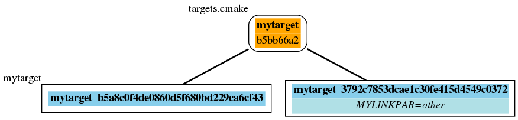
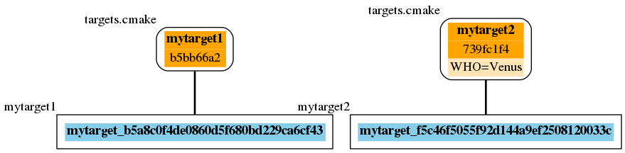
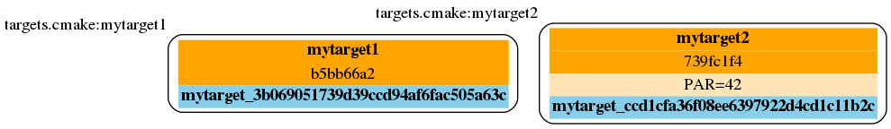
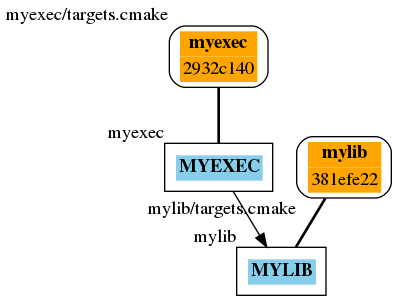
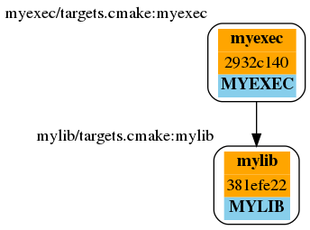

Overview
=========

Beetroot project is a set of CMake macros that set a new, user friendly paradigm of writing CMake code. It targets medium to large CMake deployments and helps by faciliating modularization and parametrization of the project description.

The idea was started in 2017, and was initially motivated by a) the fact, that usually CMake scripts rely heavily on global variables and b) CMake has very poor function parameter handling. This led to an effort to define a set of macros that facilate checking of types of function arguments. After several iterations and several complete redesignings, the current shape of the Beetroot was formed. 

Beetroot tries to nudge developers to put their targets definitions and dependency declarations inside CMake functions with a clear API interface, so it is clear on what information each target depends. In return 

#. it does a great deal of semantic checks on the user code, 
#. allows a lot of flexibility of where and how to put the user CMake code, 
#. allows to build any part of the project from anywhere,
#. can automatically turn a project into a superbuild if any of the targets are external.

Steps to start using the Beetroot:
==================================

#. Put the file ``root.cmake`` in the subfolder ``cmake`` of the root of your project. The file name and path is not hard-coded and can easily be changed. It is there so the Beetroot can be aware where is the root of your project.
#. Put a standard common header in the beginning of the ``CMakeLists.txt``, add a call ``finalizer()`` at the end of it.
#. Write target description files (either ``targets.cmake`` anywhere in the project tree, or any file with the extension ``.cmake`` in the subdirectory ``cmake/targets`` anywhere in the project tree.
#. Refer to the target you want to build inside the ``CMakeLists.txt`` by function ``build_target(<TEMPLATE_NAME> [<ARGUMENTS>])``

Beetroot data model
===================

Since you, the reader, is most probably a seasoned programmer, I believe the most straightforward way of introducing you to the Beetroot is through data model.

CMake (among other things) maintain internally an object for each defined target, and at the glance, the Beetroot's equivalent to the CMake target is a "`FEATUREBASE`" object class [1]. One target definition file can define multiple FeatureBase objects, because user can put several names in the `ENUM_TEMPLATES`. 

Each invocation of a function the requires a build of the target (e.g. `build_target()` or `get_existing_target()`) is internally represented by the object of the type "`INSTANCE`". In Beetroot INSTANCE and FEATUREBASE have one-to-many relationship; each INSTANCE is matched with a single FEATUREBASE, but a single FEATUREBASE may by linked to several INSTANCES.


If user requires two targets but the only way they differ is through the link parameters, than it is not required to actually build two copies of them and in such case each `INSTANCE` link to the same `FEATUREBASE`:


```CMake
build_target(MYTARGET)
build_target(MYTARGET MYLINKPAR other)
```




One of the base features of the Beetroot is the ability to build several copies of a target, by simply requiring it with different parameters. If such requirements are mutually incompatible (as is always the case if target parameters differ, but usually not if the features differ, and never with link parameters) than Beetroot will decide to instantiate two distinct FEATUREBASE (and CMake targets) and we will end up with 


```CMake
build_target(MYTARGET)
build_target(MYTARGET PAR 42)
```



Because one-to-one relationship between an instance and a target is common, it will be later on depicted with a common box like this:



Dependencies between targets are realized as directed links between `INSTANCES`, like this:







How does the Beetroot work?
===========================

Initialization
^^^^^^^^^^^^^^

At the beginning, when Beetroot is loaded, it scans all the subfolders of the project to find target definition files and build a database that maps template/target names to the path of the target definition file.

It also initializes internal variables (held inside global CMake storage) and loads all internal functions.

Target declaration phase
^^^^^^^^^^^^^^^^^^^^^^^^

When the initialization is complete, it reads through the rest of the ``CMakeLists.txt`` and expects to find calls to ``build_target(<TEMPLATE_NAME> [<ARGUMENTS>])``. Each call ultimately triggers user defined function ``declare_dependencies()``, where the Beetroot expects to find additional ``build_target()`` calls and marks the target to be defined later on, because no targets will be defined until the call to the ``finalize()`` at the end of the ``CMakeList.txt``. It calls all encountered ``build_target()`` recursively.

Target definition phase
^^^^^^^^^^^^^^^^^^^^^^^

Target definition phase is handled by the call to ``finalize()`` and this is when targets get defined. 

First of all, Beetroot tries to fully declare all targets that were declared with ``build_existing_target()``. 

Once all targets are declared then Beetroot can finally decide whether it is going to do a super build, or project build.

After that, if it is a project build, it enables all declared languages for all targets in the current build tree.

Finally it defines and links all the relevant targets, by calling ``generate_targets()`` user function and then ``apply_dependency_to_target()`` user function and/or ``target_link_libraries()`` CMake built in function. When on superbuild it will only attempt to define external targets.

``finalize()`` returns and by default this should be the end of the ``CMakeLists.txt``.

.. [1] Even though the CMake DSL is not object-oriented, the structure of the Beetroot code most certainly is. The code *simulates* OO features that CMake is missing using various tricks, which are a implementation detail and should not be of concern to the user.
