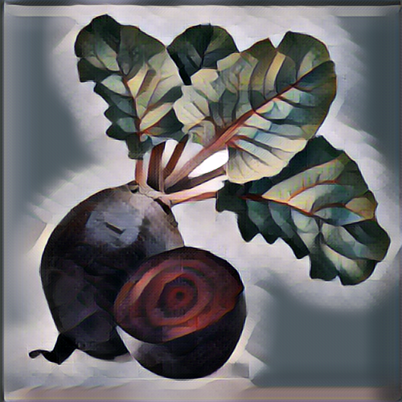

.. The Beetroot Project documentation master file, created by
   sphinx-quickstart on Tue Mar  5 18:30:14 2019.
   You can adapt this file completely to your liking, but it should at least
   contain the root `toctree` directive.

Welcome to The Beetroot Project's documentation!
================================================

.. toctree::
   :maxdepth: 2
   :caption: Contents:

   about
   features
   start

Indices and tables
==================

* :ref:`genindex`
* :ref:`modindex`
* :ref:`search`
