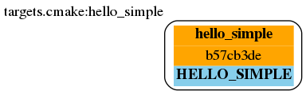
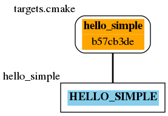
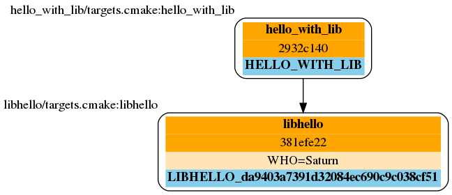
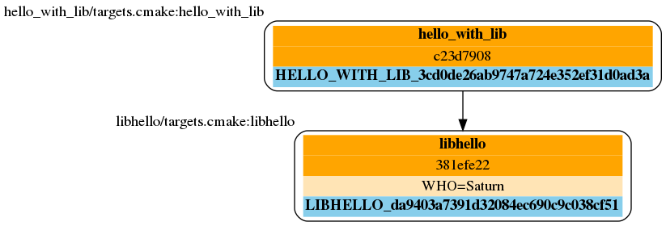

Getting started
===============

Set up the beetroot
^^^^^^^^^^^^^^^^^^^

Setting up simply means making the code of the beetroot somehow available to the CMake building process and making sure the Beetroot knows where is our superbuild root. The first part is as simple, as including the ``beetroot.cmake`` in the beginning of the  ``CMakeLists.txt``. To specify the root directory of you project you can either set it yourself using ``set(SUPERBUILD_ROOT <path>)`` *before* including the Beetroot, or relying on the Beetroots' heuristics that assume that the root directory is the topmost directory relative to the ``CMakeLists.txt`` project that contains ``CMakeLists.txt``[1]_ . 
.. [1] Beetroot tries to find superproject root using the following algorithm: The root directory is assumed to be the first directory containing ``CMakeLists.txt`` that is followed by two immidiate parent directories that are either without this file, or are a root of the filesystem. 

Perhaps the simplest way to incorporate the Beetroot into your project is to either clone it into a projects' subdirectory or make it a submodule if you already use git. 

We will now go through some tutorial build cases, which can also be found in the ``examples`` repository.

The simplest Hello World (``01_simplest_hello``)
^^^^^^^^^^^^^^^

We will to start small, with the very simple C++ CMake build. 

Suppose this is our ``source.cpp``::

   // 'Hello World!' program 
   #include <iostream>
   #define STRINGIFY2(X) #X
   #define STRINGIFY(X) STRINGIFY2(X)
   #ifndef WHO
   #define WHO World
   #endif

   int main() {
      std::cout << "Hello " STRINGIFY(WHO) "!" << std::endl;
      return 0;
   }

For reference, to build it plain CMake, this would be our ``CMakeLists.txt``::

   cmake_minimum_required(VERSION 3.5)
   project(hello_simple)
   add_executable(hello_simple source.cpp)

So far our file structure would like this::

| project_folder
| ├── build
| │   └── ...
| ├── source.cpp
| └── CMakeLists.txt
| 
| 

To be able to compile this code using Beetroot, we need first to make beetroot accessible to our build. Let's clone the beetroot into the subfolder cmake

| $ cd project_folder
| $ mkdir cmake
| $ cd cmake
| $ git clone --depth 1 https://github.com/beetroot-project/beetroot.git

Then we put the following content in the ``targets.cmake``::

   set(ENUM_TEMPLATES HELLO_SIMPLE)
   
   function(generate_targets TEMPLATE_NAME)
      add_executable(${TARGET_NAME} "${CMAKE_CURRENT_SOURCE_DIR}/source.cpp")
   endfunction()

We also need to adjust the ``CMakeLists.txt`` to have the Beetroot actually executed::

   cmake_minimum_required(VERSION 3.13)
   include(cmake/beetroot/cmake/beetroot)
   
   project(hello_simple)
   
   build_target(HELLO_SIMPLE)
   
   finalize()

Our final folder structure should look like this::

| project_folder
| ├── build
| │   └── ...
| ├── cmake
| │   └── beetroot (beetroot clone)
| │       └── ...
| ├── source.cpp
| ├── targets.cmake
| └── CMakeLists.txt
| 
| 

And finally we are set. Keep in mind, that Beetroot is designed to work best with middle and large size projects, so the amount of work to get the simplest C++ code compile is offset by the time we save when the project grows.

We compile it as usual::

   $ cd project_folder
   $ mkdir build
   $ cd build
   $ cmake .. && make 
   
       DECLARING  DEPENDENCIES  AND  DECIDING  WHETHER  TO  USE  SUPERBUILD
   
   No languages in project bootstrapped_hello_simple
   -- Discovering dependencies for HELLO_SIMPLE (HELLO_SIMPLE_f9fc6118c955867490b6f80bce90dc5b)...
   
   
   
       DEFINING  TARGETS  IN  PROJECT BUILD
       TESTS  disabled
   
   -- The CXX compiler identification is GNU 7.3.0
   -- Check for working CXX compiler: /home/adam/spack/opt/spack/linux-ubuntu16.04-x86_64/gcc-8.1.0/gcc-7.3.0-zclb4ttmy53mjkahiocmsqozhu6veriz/bin/g++
   -- Check for working CXX compiler: /home/adam/spack/opt/spack/linux-ubuntu16.04-x86_64/gcc-8.1.0/gcc-7.3.0-zclb4ttmy53mjkahiocmsqozhu6veriz/bin/g++ -- works
   -- Detecting CXX compiler ABI info
   -- Detecting CXX compiler ABI info - done
   -- Detecting CXX compile features
   -- Detecting CXX compile features - done
   -- Configuring done
   -- Generating done
   -- Build files have been written to: /home/adam/beetroot-examples/hello_simple/build
   
   Scanning dependencies of target bootstrapped_hello_simple
   [ 50%] Building CXX object CMakeFiles/bootstrapped_hello_simple.dir/source.cpp.o
   [100%] Linking CXX executable bootstrapped_hello_simple
   [100%] Built target bootstrapped_hello_simple
   $ ls
   hello_simple  CMakeCache.txt  CMakeFiles  cmake_install.cmake  Makefile
   $ ./hello_simple
   Hello World!

Beetroot has built-in dependency graph generator in the dot language. This simples project can be visualized as 

There are minimum two types of object directly involved when building even the simplest of projects: `INSTANCE` and `FEATUREBASE`. If the user code actually produce a CMake target, then `FEATUREBASE` is a proxy class to it (with one-to-one relationship if user code define a new target), whereas `INSTANCE` also encapsulates the linking information - how should the dependency influence the callee. 

Because it is very common case that there is one-to-one relationship between the `FEATUREBASE` and the `INSTANCE` - i.e. between the target and the place it is defined (as always the case in plaine CMake), the former diagram is simplified to this:

  

The Hello World with parameter (``02_parameter_hello``)
^^^^^^^^^^^^^^^^^^^^^^^^^^

Now let's start complicating things. You may have noticed, that we have a macro parameter ``WHO`` in our C++ file, that can be used to change the program's output. Let's do just that. After all, handling target parameters is one of the strongest sides of Beetroot. Let's modify our ``targets.cmake`` and insert definition of the parameter, which we will also call ``WHO``::

   set(ENUM_TEMPLATES HELLO_SIMPLE)
   
   set(TARGET_PARAMETERS 
      WHO SCALAR STRING "Beetroot"
   )
   
   function(generate_targets TEMPLATE_NAME)
      add_executable(${TARGET_NAME} "${CMAKE_CURRENT_SOURCE_DIR}/source.cpp")
      target_compile_definitions(${TARGET_NAME} PRIVATE "WHO=${WHO}")
   endfunction()

The name of the parameter does not need to match the name of the preprocessor macro. The formal syntax is this: ``TARGET_PARAMETERS`` is an array organized into 4-element tuples.

#. First element of the tuple is the name of the parameter, then
#. container type. There are three container types: ``OPTIONAL``, ``SCALAR`` and ``VECTOR``, and they correspond to the CMake options, scalars and lists.
#. Element type. At the moment the are 5 possible types: ``BOOL``, ``INTEGER``, ``PATH``, ``STRING`` and ``CHOICE(<colon-separated list of possible values>)``.
#. Default value. 

In the function body we need to tie the parameter with the target, and we do that in the usual CMake way, by using ``target_compile_definitions()``. All target parameters are always implicitely available in the function ``generate_targets``, so we can simply use them.

If we compile the program and run we get::

   $./hello_simple
   Hello Beetroot!

Let's say, that this file is our unit test and we need to compile three of them, one for the default string, and the other for a special string "Mars" and "Venus". It is easy with Beetroot, and by doing this we will demonstrate two ways of passing variables to targets. Let's re-write the ``CMakeLists.txt``::

   cmake_minimum_required(VERSION 3.13)
   include(../cmake/beetroot/cmake/beetroot_bootstrap)
   
   project(hello_simple)
   
   build_target(HELLO_SIMPLE)
   set(WHO "Venus")
   build_target(HELLO_SIMPLE)
   build_target(HELLO_SIMPLE WHO Mars)
   
   finalize()

After we build, we should get three executables: ``hello_simple1``, ``hello_simple2`` and ``hello_simple3``.::

   $./hello_simple1
   Hello Beetroot!
   $./hello_simple2
   Hello Venus!
   $./hello_simple3
   Hello Mars!

The ``targets.cmake`` defines a target _template_, that can be used to define as many targets, as there are unique combinations of target parameters. That is why the ``generate_targets()`` function requires user to use ``${TARGET_NAME}`` instead of hard-coded name, that is usual in standard CMake practice. The function will be called exactly once for each distinct ``${TARGET_NAME}`` that Beetroot found is required to satisfy the parameters.

Targets composed from components (``03_subprojects_basics``)
^^^^^^^^^^^^^^^^^^^^^^^^^^^^^^^^
Here you will learn how to combine targets together and use more realistic folder structure.

Suppose we have a program, that requires a function ``get_string`` from a library to run. The `hello_with_lib.cpp`::

	#include <iostream>
	#include "libhello.h"
	
	#ifndef LIBPAR
	#define LIBPAR 0
	#endif
	
	int main()
	{
	  int libpar = LIBPAR;
	  
	  std::cout << "Hello "<< get_string()<<"!"<< std::endl;
	  return 0;
	}

To compile it, we need a `libhello.h` that provides the ``get_string()``::

	#include<string>
	std::string get_string();

The library's implementation is in the file ``libhello.cpp``::

	#include "libhello.h"
	#define STRINGIFY2(X) #X
	#define STRINGIFY(X) STRINGIFY2(X)

	#ifndef WHO
	#define WHO World
	#endif

	std::string get_string() {
		return(STRINGIFY(WHO));
	}

The library depends on one macro: ``WHO`` that influences the text returned by the function.

We would like to have the ``hello_with_lib.cpp`` compiled and linked with the ``libhello``. Although there is nothing wrong with putting the additional CMake commands in the old ``targets.cmake`` file, it is better to modularize our design and create two separate targets, so it will be easy to re-use the ``libhello`` by simply importing it.

Now is a time notice that the Beetroot by default does not care about the location of the target definitions. Instead it scans recursively all the superproject files in search for files ``targets.cmake`` and subfolder structure ``cmake/targets/*.cmake``. Then it loads each fond file and learns the name of the targets/templates exposed there to build a mapping target/template name -> path of the target definition file, so user does not need to care about the paths anymore. On the other hand it requires that each each target/template name is unique across the whole superproject.

Let's create the following directory structure::

| superproject
| ├── cmake
| │   ├── beetroot (beetroot clone)
| │   │   └── ...
| │   └── root.cmake
| ├── hello_with_lib
| │   ├── hello_with_lib.cpp
| │   ├── CMakeLists.txt
| │   └── targets.cmake
| ├── libhello
| │   ├── include
| │   │   └── libhello.h
| │   ├── source
| │   │   └── libhello.cpp
| │   └── targets.cmake
| └── CMakeLists.txt
| 
| 

This is the definition of the ``libhello/targets.cmake``::

   set(ENUM_TEMPLATES LIBHELLO)
   
   set(TARGET_PARAMETERS 
      WHO	SCALAR	STRING	"Jupiter"
   )
   
   function(generate_targets TEMPLATE_NAME)
      add_library(${TARGET_NAME} "${CMAKE_CURRENT_SOURCE_DIR}/source/libhello.cpp")
      target_source(${TARGET_NAME} PRIVATE "${CMAKE_CURRENT_SOURCE_DIR}/include/libhello.h") #For better IDE integration
      
      target_include_directories(${TARGET_NAME} PUBLIC ${CMAKE_CURRENT_SOURCE_DIR}/include)
      target_compile_definitions(${TARGET_NAME} PRIVATE "WHO=${WHO}")
   endfunction()

Nothing new, except we use ``add_library`` instead of ``add_executable``. Adding ``libhello.h`` to sources is not strictly necessary, but is a good CMake practice, that helps various IDE generators generate better projects. 

This is the definition of the ``hello_with_lib/targets.cmake``::

   set(ENUM_TEMPLATES HELLO_WITH_LIB)
   
   function(declare_dependencies TEMPLATE_NAME)
      build_target(LIBHELLO WHO "Saturn")
   endfunction()
   
   function(generate_targets TEMPLATE_NAME)
      add_executable(${TARGET_NAME} "${CMAKE_CURRENT_SOURCE_DIR}/hello_with_lib.cpp")
   endfunction()

The new element, the ``declare_dependencies()`` function, is used to declare dependencies. It is a function, so user can build complex logic that turns certain dependencies on and off depending on the Target Parameters and Features. To declare a certain target/template a dependency we call a function ``build_target(<TEMPLATE_OR_TARGET_NAME> [<PARAMETERS>...])``. The API and behaviour is exactly the same, as in ``CMakeLists.txt``.

In ``hello_with_lib/CMakeLists.txt`` all we need is

   cmake_minimum_required(VERSION 3.13)
   include(../cmake/beetroot/cmake/beetroot.cmake)

   project(hello_simple)

   build_target(HELLO_WITH_LIB)

   finalize()

The location of the ``CMakeLists.txt`` is irrelevant in the Beetroot. You can as easily compile everything from within the root of the project if the root ``CMakeLists.txt`` is:

   cmake_minimum_required(VERSION 3.13)
   include(cmake/beetroot/cmake/beetroot.cmake)

   project(hello_simple)

   build_target(HELLO_WITH_LIB)

   finalize()

All we did aws a change to the directory of the beetroot library in the second line.

Forwarding parameters from dependencies (``04_subproject_pars``)
^^^^^^^^^^^^^^^^^^^^^^^^^^^^^^^^^^^^^^^^^^^^^^^^^^^^^^^^^^^^^^^^

In the real life you will often find yourself putting many parametrized customizations to the components that play the role of the libraries in your project. Many of those parameters you would want to expose as customizations in the target executable - sort of forwarding those parameters from dependency to the dependee. Without an extra support for this common pattern, you would need to define again all the forwarded parameters in the body of dependee, and be carefull to match the type and container class to avoid configure errors.

To address this specific problem there are three functions: 
* ``include_target_parameters_of()`` to forward parameters,
* ``include_link_parameters_of()`` to forward link parameters, and
* ``include_features_of()`` to forward features (we will talk about them later).

Finally there is a universal function ``include_target_parameters_univ()`` that incorporates functionality of all those three functions in one place.

The function call must be placed in the body of the ``targets.cmake``, outside of the body of any function defined there, just along the place where you would normally define parameters.

The syntax is ``include_target_parameters_univ( <TEMPLATE_NAME> TARGET_PARAMETERS|LINK_PARAMETERS|TARGET_FEATURES [NONRECURSIVE] [SOURCE TARGET_PARAMETERS|LINK_PARAMETERS|TARGET_FEATURES] [ALL_EXCEPT <list of parameters>] [INCLUDE_ONLY <list of parameters>])``

The function imports the parameters from the specified template and acts as if you would copy-pasted them manually reducing code deduplication and ensuring consistency. 

For better consistency user can choose whether to pick the names of imported parameter himself or to import all except the blacklisted names.

In the latter case, functions are capable of mass-importing all parameters (with exception of those in ``ALL_EXCEPT``) from the single template. Since that template itself can use these functions to forward parameters from its dependencies, the amount of parameters can potentially get massive. In order to better control this situation, they offer ``NONRECURSIVE`` flag, that prevents it from importing the forwarded parameters.

The example ``04_subproject_pars`` is exactly the same with the exception of adding 

   include_target_parameters_of(LIBHELLO
   	INCLUDE_ONLY
   		WHO
   )

to the ``hello_with_lib/targets.cmake``, so it reads like this:

   set(ENUM_TEMPLATES HELLO_WITH_LIB)
   
   include_target_parameters_of(LIBHELLO
   	INCLUDE_ONLY
   		WHO
   ) #Implicitly imports (forwards) only WHO. 
   
   function(declare_dependencies TEMPLATE_NAME)
      build_target(LIBHELLO WHO "Saturn")
   endfunction()
   
   function(generate_targets TEMPLATE_NAME)
      add_executable(${TARGET_NAME} "${CMAKE_CURRENT_SOURCE_DIR}/hello_with_lib.cpp")
      target_compile_definitions(${TARGET_NAME} PRIVATE "WHO=${WHO}") # ${WHO} is now available and can be used as a compile option
   endfunction()
   

Code generators (``05_codegen``)
^^^^^^^^^^^^^^^

From the Beetroot point of view, code generators are targets that require special linking action - "linking" with the generated source file means adding additional source to the dependee using ``target_sources()`` CMake function.

Let us implement a code simple code generator that uses ``configure_file()``. If this example may look too simple to be realistic, remember that the Beetroot does not replace common CMake idioms regarding low-level file handling. The example can as well use ``add_custom_command()`` instead. Or it may even generate code during the configure phase (important when you do not know the names of the generated files before you actually generate them. In that case you would need to call the code generator via ``execute_process()`` and gather the resulted files by the means of file globbing). 

Imagine the ``src.cpp.in``:

   const char* getVersion()
   {
       return "@MyProj_VERSION@";
   }

This is the definition of the ``hello_with_lib/targets.cmake``::

   set(ENUM_TEMPLATES HELLO_WITH_LIB)
   
   include_target_parameters_of(LIBHELLO
   	INCLUDE_ONLY
   		WHO
   ) #Implicitly imports only WHO. See API reference to learn about all the options
   
   function(declare_dependencies TEMPLATE_NAME)
      build_target(LIBHELLO WHO "Saturn")
   endfunction()
   
   function(generate_targets TEMPLATE_NAME)
      add_executable(${TARGET_NAME} "${CMAKE_CURRENT_SOURCE_DIR}/hello_with_lib.cpp")
      target_compile_definitions(${TARGET_NAME} PRIVATE "WHO=${WHO}") # ${WHO} is now available
   endfunction()

Subcomponents that influence the parent
^^^^^^^^^^^^^^^^^^^^^^^^^^^^^^^^^^^^^^^

When we require the subcomponent in function ``declare_dependencies`` we have a total control of all the information (i.e. parameters) the component receive. But what if we want the component to influence the build process of the parent project as well? Imagine this simple logging example - we want to include logging support to our application by 

TODO: Find a good case (better than target_compile_definitions with log or target_include_directories for header libraries)

We have seen in `The Hello World with parameter`_ that for each unique variation of the parameters of the compoment Beetroot defines a distinct target. That is a welcome feature if the parameter modifies the compilation process of the component, but what if we need to parametrize *linking*?

   #include <iostream>
   #include <boost/log/trivial.hpp>

   int main(int, char*[])
   {
       BOOST_LOG_TRIVIAL(info) << “This is an informational severity message”;
       std::cin.get();
       return 0;
   }

External projects and the superbuild idiom
^^^^^^^^^^^^^^^^^^^^^^^^^^^^^^^^^^^^^^^^^^

External projects are CMake projects that need a separate CMake run to be built. If they are written properly, the act of installing them (after build) would result in the `<project name>Config.cmake` files describing the way the library shuld be linked to  our project. Those files are then be used when we import the library using CMake's command `find_packages()` or one of its specialized forms, like `find_boost()`.

The library can either be already installed by the OS packaging system, or we need to provide the source code, build and install it ourselves. In the latter case, it is customary to include that library as our dependency in the form of a git submodule (if both the library and our project is using git) or download script executed during build. 

The problem is that the `<project name>Config.cmake` files of the dependency appear only after it was build, and installed which is after the CMake finished running our script and there is no way for them to influence the configuration of our project, resuling in the build failure on the first build (The subsequent builds will be fine). The most robust way to solve this problem is to execute the *superbuild* idiom.

Superbuild idiom means putting our project as the last external dependency of the "super project", which depends on all the external dependencies and building that project instead of the original. When user calls `cmake <our_project>` CMake first makes sure all the external projects are built and installed, and then at the end calls the CMake again to process our own project - this time we can be sure that all the dependencies are built and update. 

Beetroot automatically switches to the superbuild idiom automatically everytime we define any external targets. 

The Beetroot treats the target as external if the template file sets non-empty contents to the  *`DEFINE_EXTERNAL_PROJECT`* variable. There are 

Non-compiled components (e.g. header libraries)
^^^^^^^^^^^^^^^^^^^^^^^^^^^^^^^^^^^^^^^^^^^^^^^

In the CMake, there are two ways of implementing the header-only libraries: the old, deprecated method that involves using ``target_include_directories()`` on the dependee target (target that is needs to use the library) or the current best-practise method that involves defining the target with only "interface" properties. Let's start with the modern way first:

Imagine, that the ``hello_with_lib`` is also responsible for setting a macro variable in the client's code. Let's predend that this variable modifies behavior of the header-only part of this library. Consequently will not change the library code. We only need to make sure, that clients linking to our library receive a new preprocessor macro::

   set(ENUM_TEMPLATES LIBHELLO)
   
   set(TARGET_PARAMETERS 
      WHO	SCALAR	STRING	"Jupiter"
   )
   
   set(LINK_PARAMETERS 
      LIBPAR	INTEGER	
   )
   
   function(apply_dependency_to_target DEPENDEE_TARGET_NAME OUR_TARGET_NAME)
      target_compile_definitions(${DEPENDEE_TARGET_NAME} PRIVATE "LIBPAR=${LIBPAR}")
   endfunction()

